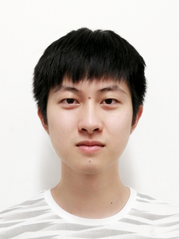

  

 Liqiang Lin

 Email: linliqiang2020 at gmail dot com

 
<i class="fa-brands fa-google fa-sm"></i>
<a href="https://scholar.google.com/citations?user=OWjgUJoAAAAJ">Scholar</a>
<i class="fa-brands fa-github-alt"></i>
<a href="https://github.com/linxius">Github</a> 
<i class="fa-brands fa-twitter"></i>
<a href="https://twitter.com/liqianglin">Twitter</a> 

I am a PhD candidate of Computer Science at College of Computer Science and Software Engineering, Shenzhen University. My supervisor is Prof. Hui Huang. My research interest lies in computer grahics, especially in point cloud, urban scene perception and reconstruction. I currently a reviewer of  IEEE Transactions on Visualization and Computer Graphics (TVCG).

#### Education 
- 2015 to 2019: Bachelar, Xidian University, Electronic and Information Engineering
- 2019 to now: PhD candidate, Shenzhen University, Computer Science and Technology
- Expected graduation time: June 2024

#### Publications
1. **Liqiang Lin**, Yilin Liu, Yue Hu, Xinguang Yan, and Hui Huang*. 
Capturing, Reconstructing, and Simulating: the UrbanScene3D Dataset. ECCV 2022. 
[[Project Page]](https://vcc.tech/UrbanScene3D)
[[PDF]](https://arxiv.org/pdf/2107.04286.pdf)
[[Code]](https://github.com/Linxius/UrbanScene3D)

2. **Liqiang Lin**, Pengdi Huang, Chi-Wing Fu, Kai Xu, Hao Zhang, and Hui Huang*. 
On Learning the Right  Attention Point for Feature Enhancement. 
Science China Information Sciences 2022. 

3. Xingguang Yan, **Liqiang Lin**, Niloy J. Mitra, Dani Lischinski, Daniel Cohen-Or, and Hui Huang*. 
ShapeFormer: Transformer-based Shape Completion via Sparse Representation. CVPR 2022.

4. **Liqiang Lin**†, Pengdi Huang†, Fuyou Xue, Kai Xu, Daniel Cohen-Or, and Hui Huang*. 
Hausdorff point convolution with geometric priors. 
Science China Information Sciences 64, no.11 (2021): 1-13.（共同一作）

5. Pengdi Huang, **Liqiang Lin**, Kai Xu, and Hui Huang*. 
Autonomous outdoor scanning via online topological and geometric path optimization. 
IEEE Transactions on Intelligent Transportation Systems (2020).

#### Other Achievements
- 授权中国发明专利：黄惠，林力强，点云特征增强方法、装置、计算机设备和存储介质（授权号：ZL202110452686.8），授权时间：2021-07-27
- 申请美国发明专利：Hui Huang, Liqiang Lin. Point cloud feature enhancement and apparatus, computer device and storage medium（申请号: 17/498,754）, 申请日: 2021-10-12
- 登记软件著作权：黄惠，林力强，黄鹏頔，用于点云特征学习的有向注意力点软件，软著登字第 7432865 号，完成日：2020-11-01
- 国家自然科学企业联合基金重点项目（U21B2023）：透明、高反光材质复杂物体高精度三维采集重建关键技术研究，2022/01—2025/12，300 万，黄惠（主持），林力强（参与）
- 国家自然科学广东联合基金重点项目（U2001206）：图感知与耦合计算关键技术研究，2021/01—2024/12，350万，黄惠（主持），林力强（参与）